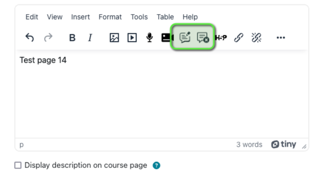

moodle-tiny_corrections
========================

## Installation

- Unzip the contents of the zip archive into the Moodle `.../lib/editor/tiny/plugins/corrections` directory.

## Configuration
The correction types are defined on the [MOODLE_URL]/admin/settings.php?section=tiny_corrections_settings page.
Correction types can be defined using the following syntax :
```
a = plurialization
c = conjugation
d = determinant
g = grammar/syntax
...
```

## Usage
The plugin adds two new buttons to the TinyMCE editor toolbar. 
When clicked, the "Add correction" button will open a dialog box that allows the user to select a correction to apply to the selected text.
The "Remove correction" button will remove the correction from the text around the cursor.



